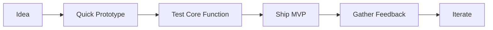

# Development Guidelines

## 🎯 Development Philosophy

As a solo developer building a billion-dollar company, our focus is on:
1. **Speed with Quality**: Move fast without breaking things
2. **Automation First**: Automate everything that can be automated
3. **MVP Mindset**: Build the minimum viable feature, then iterate
4. **Technical Debt Management**: Be pragmatic about technical debt
5. **Documentation as Code**: Keep documentation close to code

## 🚀 Quick Start

```bash
# Clone the repository
git clone https://github.com/yourusername/ghn-mvp.git

# Install dependencies for both frontend and backend
cd ghn-mvp/frontend && npm install
cd ../backend && pip install -r requirements.txt

# Set up environment variables
cp frontend/.env.example frontend/.env
cp backend/.env.example backend/.env

# Start development servers
# Terminal 1: Frontend
cd frontend && npm run dev

# Terminal 2: Backend
cd backend && python -m uvicorn main:app --reload
```

## 📋 Development Process

### 1. Feature Development



1. **Planning**:
   - Create a quick design doc in `docs/design/`
   - Break down into small, shippable chunks
   - Set clear success metrics

2. **Development**:
   - Work in small, focused commits
   - Write tests for critical paths
   - Document as you code

3. **Testing**:
   - Run automated tests
   - Manual testing of critical paths
   - Performance impact check

4. **Deployment**:
   - Use automated deployment
   - Monitor for issues
   - Be ready to rollback

### 2. Code Organization

```
ghn-mvp/
├── frontend/          # React frontend
│   ├── src/
│   │   ├── components/  # Reusable UI components
│   │   ├── pages/      # Route components
│   │   ├── store/      # State management
│   │   └── utils/      # Helper functions
│   └── tests/
└── backend/           # FastAPI backend
    ├── app/
    │   ├── models/     # Data models
    │   ├── routes/     # API endpoints
    │   └── services/   # Business logic
    └── tests/
```

### 3. Coding Standards

#### TypeScript/React (Frontend)
- Use functional components with hooks
- Implement proper error boundaries
- Keep components small and focused
- Use TypeScript for type safety

```typescript
// ✅ Good
const UserProfile: FC<UserProfileProps> = ({ user }) => {
  const { data, error } = useUserData(user.id);
  
  if (error) return <ErrorDisplay error={error} />;
  if (!data) return <Loading />;
  
  return <UserProfileDisplay data={data} />;
};

// ❌ Avoid
const UserProfile = (props) => {
  // Untyped props, no error handling
  return <div>{props.user.name}</div>;
};
```

#### Python/FastAPI (Backend)
- Use type hints
- Implement proper error handling
- Keep functions small and focused
- Document API endpoints

```python
# ✅ Good
@router.post("/users", response_model=UserResponse)
async def create_user(user: UserCreate) -> UserResponse:
    """Create a new user.
    
    Args:
        user: User creation data
        
    Returns:
        Created user data
        
    Raises:
        HTTPException: If user already exists
    """
    if await user_exists(user.email):
        raise HTTPException(status_code=400, detail="User already exists")
    return await create_user_in_db(user)

# ❌ Avoid
@router.post("/users")
def create_user(data: dict):
    # No type hints, no documentation
    return db.create_user(data)
```

### 4. Testing Strategy

#### Critical Path Testing
Focus on testing what matters most:
1. User authentication flows
2. Data persistence operations
3. Payment processing
4. Core business logic

#### Test Structure
```typescript
// Frontend test example
describe('PaymentFlow', () => {
  it('should process payment successfully', async () => {
    const payment = await processPayment({
      amount: 100,
      currency: 'USD'
    });
    expect(payment.status).toBe('success');
  });
});
```

```python
# Backend test example
def test_user_creation():
    """Test user creation flow."""
    user = create_user({
        "email": "test@example.com",
        "password": "secure123"
    })
    assert user.email == "test@example.com"
    assert user.is_active
```

### 5. Performance Guidelines

1. **Frontend**:
   - Implement code splitting
   - Use proper caching strategies
   - Optimize bundle size
   - Monitor Core Web Vitals

2. **Backend**:
   - Use async operations
   - Implement proper database indexing
   - Cache frequently accessed data
   - Monitor response times

### 6. Security Checklist

- [ ] Implement proper authentication
- [ ] Use HTTPS everywhere
- [ ] Sanitize user inputs
- [ ] Implement rate limiting
- [ ] Regular dependency updates
- [ ] Proper error handling
- [ ] Secure data storage
- [ ] API input validation

### 7. Deployment Process


1. **Staging**:
   - Deploy to staging environment
   - Run integration tests
   - Check performance metrics

2. **Production**:
   - Use automated deployments
   - Implement feature flags
   - Monitor error rates
   - Ready rollback plan

## 🔄 Continuous Improvement

### Daily Routine
1. Review error logs
2. Check performance metrics
3. Address critical issues
4. Plan next features
5. Update documentation

### Weekly Review
1. Code quality check
2. Performance review
3. Security updates
4. Documentation updates
5. Planning next week

## 📈 Metrics to Track

1. **Technical**:
   - Error rates
   - Response times
   - Test coverage
   - Build times

2. **Business**:
   - User growth
   - Revenue metrics
   - Customer feedback
   - Feature usage

## 🆘 Emergency Response

1. **Production Issues**:
   ```bash
   # Quick rollback command
   git checkout last-known-good-commit
   npm run deploy
   ```

2. **Data Issues**:
   ```bash
   # Backup command
   pg_dump -U postgres db_name > backup.sql
   ```

3. **Contact Info**:
   - Emergency contacts
   - Service providers
   - Support channels

Remember: As a solo developer, focus on high-impact work and automate everything else. Build for scale but stay pragmatic.
