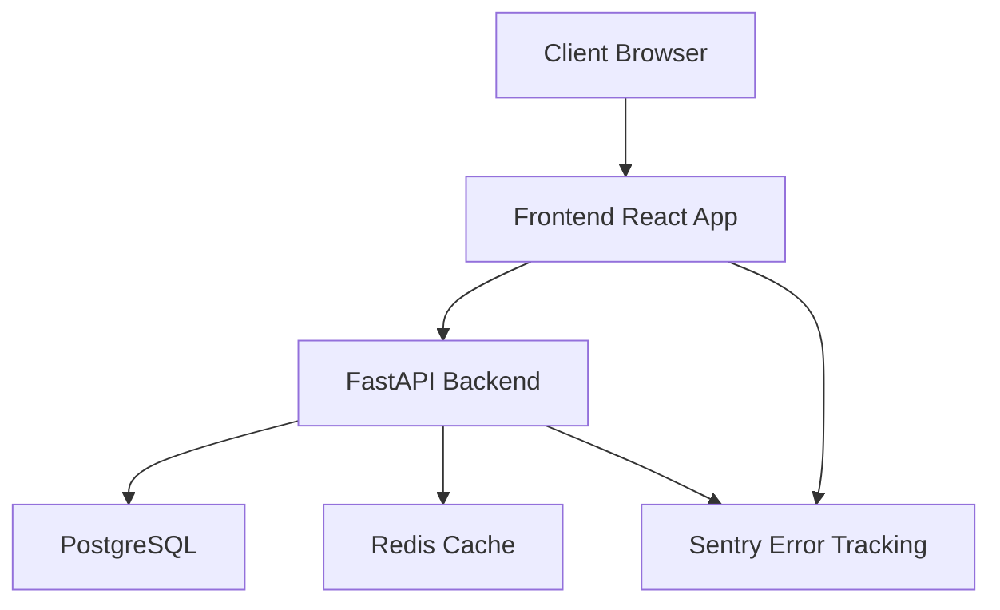
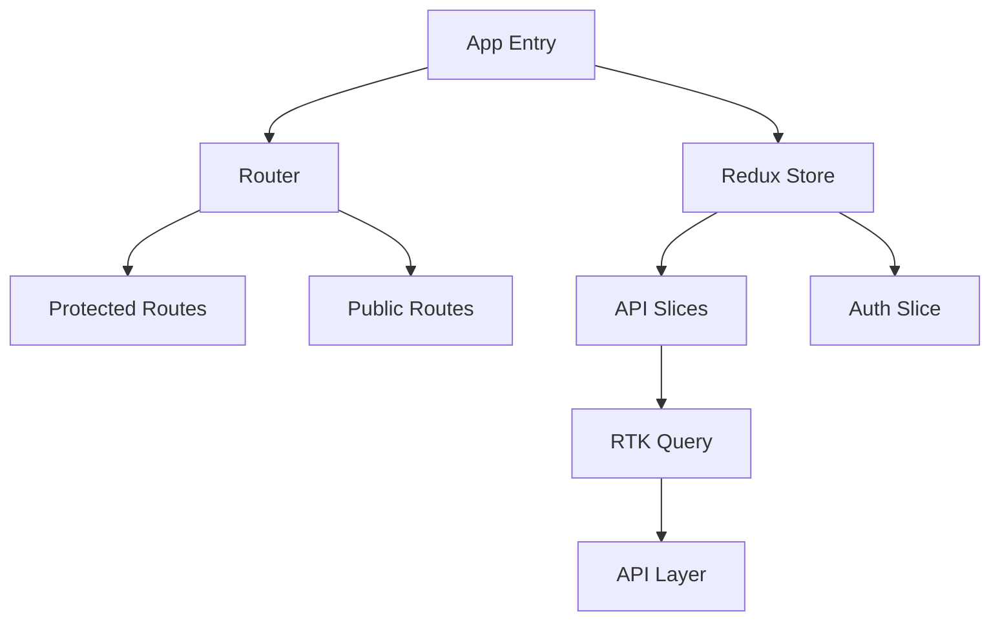
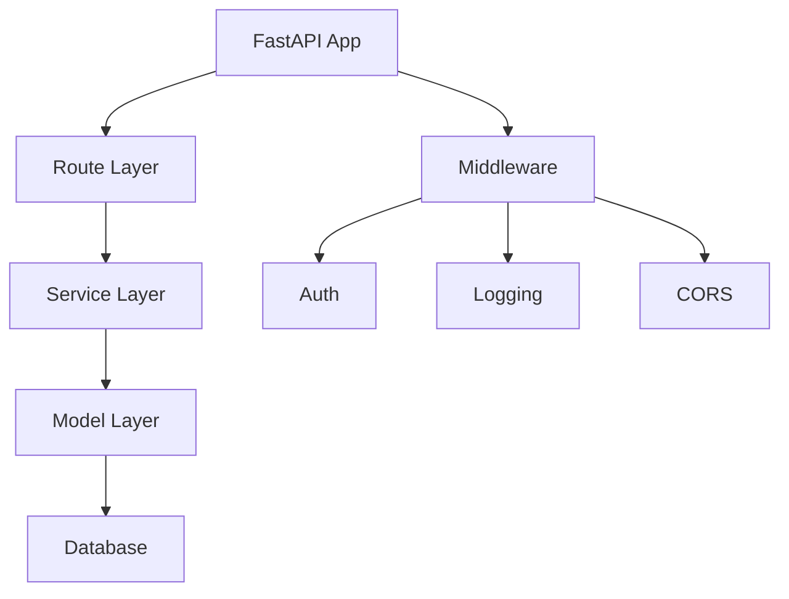
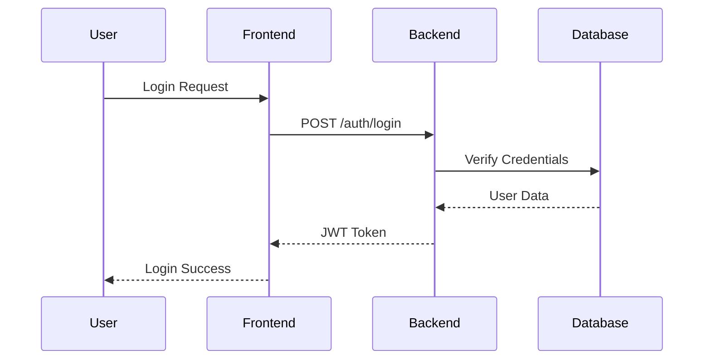
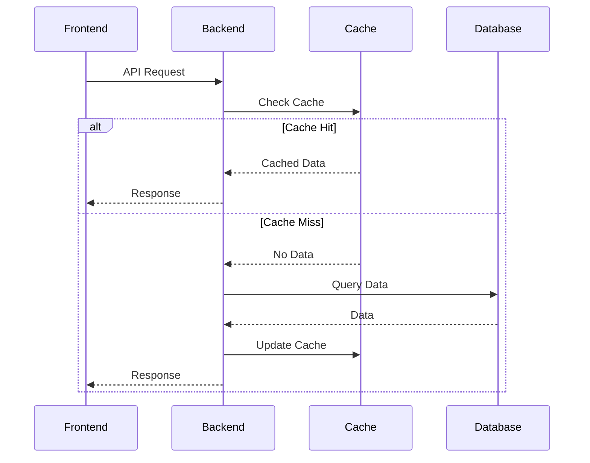

# System Architecture

## Overview

The Global Health Network (GHN) MVP is built with scalability and maintainability in mind, while being pragmatic for solo development.



## Core Components

### Frontend Architecture



#### Key Features
- React 18 with TypeScript
- Redux Toolkit for state management
- RTK Query for data fetching
- Error Boundaries for reliability
- Tailwind CSS for styling
- Sentry for error tracking

### Backend Architecture



#### Key Features
- FastAPI with async support
- PostgreSQL database
- Redis for caching
- JWT authentication
- OpenAPI documentation
- Sentry integration

## Data Flow

### Authentication Flow


### API Request Flow


## Security Architecture

### Authentication & Authorization
- JWT-based authentication
- Role-based access control
- Secure password hashing
- Rate limiting
- CORS protection

### Data Security
- HTTPS everywhere
- Database encryption
- Secure environment variables
- Input validation
- Output sanitization

## Scalability Considerations

### Frontend Scalability
- Code splitting
- Lazy loading
- Service worker caching
- CDN integration
- Progressive enhancement

### Backend Scalability
- Async operations
- Database indexing
- Query optimization
- Caching strategy
- Horizontal scaling ready

## Monitoring & Observability

### Error Tracking
- Sentry integration
- Error boundaries
- Structured logging
- Performance monitoring
- User feedback collection

### Performance Monitoring
- Core Web Vitals
- API response times
- Database query times
- Cache hit rates
- Error rates

## Development Workflow

### Local Development
```bash
# Frontend
npm run dev # Vite dev server

# Backend
uvicorn main:app --reload # FastAPI dev server
```

### Testing
```bash
# Frontend
npm run test # Jest tests
npm run e2e # Cypress tests

# Backend
pytest # Python tests
```

### Deployment
```bash
# Frontend
npm run build # Production build
npm run deploy # Deploy to hosting

# Backend
docker build . # Build container
docker push # Push to registry
```

## Future Considerations

### Planned Improvements
1. GraphQL API layer
2. Real-time notifications
3. Offline support
4. Analytics integration
5. AI/ML features

### Scaling Strategy
1. Microservices split
2. Container orchestration
3. Global CDN
4. Database sharding
5. Message queues

## Technical Debt Management

### Current Technical Debt
- Document in `docs/tech-debt/`
- Prioritize in sprints
- Regular refactoring
- Automated testing
- Code review notes

### Debt Prevention
- Code standards
- Automated checks
- Documentation
- Regular reviews
- Performance budgets

Remember: As a solo developer, focus on maintainable architecture that can scale with the business while staying pragmatic about implementation.
