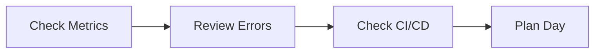
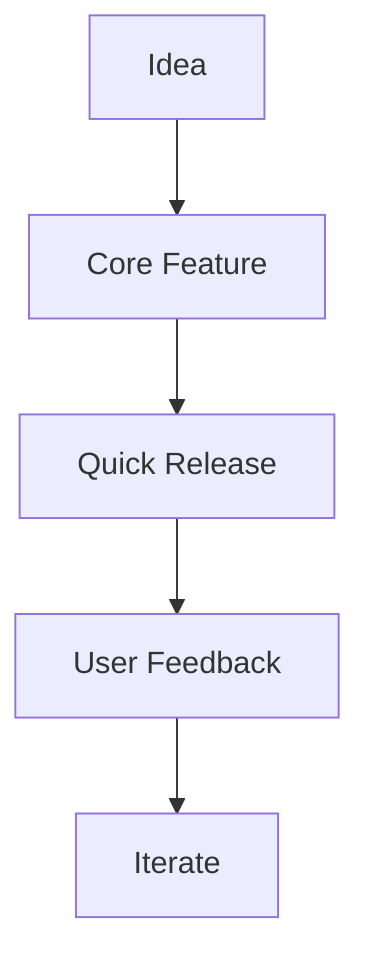
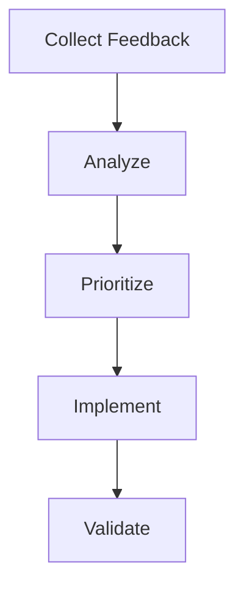

# Solo Developer Playbook

## 🎯 Mission
Building a billion-dollar company as a solo developer requires exceptional efficiency and focus. This playbook provides strategies to maximize impact while maintaining high quality.

## 📋 Daily Workflow

### 1. Morning Routine (1 hour)


- [ ] Review error logs and metrics
- [ ] Check system health
- [ ] Prioritize day's tasks
- [ ] Update task board

### 2. Development Time (4-6 hours)
- Focus on high-impact features
- Work in 90-minute focused blocks
- Take regular breaks
- Document as you code

### 3. Business Development (2-3 hours)
- Customer feedback review
- Market research
- Strategic planning
- Network building

### 4. Learning & Improvement (1 hour)
- Study new technologies
- Read industry news
- Review competitors
- Plan improvements

## 🎮 Development Controls

### Version Control Strategy
```bash
# Feature branches
git checkout -b feature/user-auth

# Commit template
git commit -m "feat(auth): implement user login
- Add JWT authentication
- Create login form
- Add error handling
- Update tests"

# Quick fixes
git commit -m "fix(auth): handle expired tokens"
```

### Code Quality Checks
```bash
# Frontend
npm run lint
npm run test
npm run type-check

# Backend
flake8 .
mypy .
pytest
```

### Deployment Checklist
- [ ] All tests passing
- [ ] No type errors
- [ ] Documentation updated
- [ ] Performance checked
- [ ] Security reviewed

## 🚀 Growth Hacks

### 1. Automation First
Automate everything that:
- Takes more than 5 minutes
- Is done more than once a week
- Is error-prone
- Requires monitoring

### 2. MVP Strategy


### 3. Technical Debt Management
- Keep a debt log
- Schedule regular refactoring
- Use feature flags
- Maintain test coverage

## 💼 Business Operations

### 1. Customer Feedback Loop


### 2. Marketing Strategy
- Content marketing
- Open source contributions
- Social media presence
- Speaking engagements

### 3. Revenue Tracking
```sql
-- Monthly Revenue Query
SELECT 
    DATE_TRUNC('month', payment_date) as month,
    SUM(amount) as revenue,
    COUNT(DISTINCT user_id) as paying_users
FROM payments
GROUP BY 1
ORDER BY 1 DESC;
```

## 🛠 Tools & Services

### Development
- VS Code + Extensions
- GitHub Copilot
- Postman
- Docker Desktop

### Operations
- GitHub Actions
- Vercel/Netlify
- AWS/GCP
- Stripe

### Monitoring
- Sentry
- Google Analytics
- LogRocket
- Grafana

### Communication
- Slack
- Discord
- Email
- Calendar

## 📈 Metrics to Track

### Technical Metrics
```typescript
interface TechnicalMetrics {
  errorRate: number;
  responseTime: number;
  testCoverage: number;
  deploymentFrequency: number;
  uptimePercentage: number;
}
```

### Business Metrics
```typescript
interface BusinessMetrics {
  monthlyRevenue: number;
  activeUsers: number;
  customerAcquisitionCost: number;
  lifetimeValue: number;
  churnRate: number;
}
```

## 🆘 Emergency Procedures

### 1. Production Issues
```bash
# Quick rollback
git revert HEAD
git push origin main

# Database restore
pg_restore -d dbname latest.dump

# Service restart
docker-compose down
docker-compose up -d
```

### 2. Data Loss Prevention
- Regular backups
- Audit logging
- Version control
- Data encryption

### 3. Security Incidents
- Incident response plan
- Communication templates
- Legal compliance
- Insurance coverage

## 📚 Knowledge Management

### 1. Documentation
- Code comments
- API documentation
- Architecture diagrams
- Decision records

### 2. Learning Resources
- Online courses
- Technical books
- Industry blogs
- Conferences

### 3. Network Building
- Industry meetups
- Online communities
- Mentorship
- Partnerships

## 🎯 Focus Areas

### 1. Technical Excellence
- Clean code
- Automated testing
- Performance optimization
- Security best practices

### 2. Business Growth
- User acquisition
- Revenue generation
- Cost optimization
- Market expansion

### 3. Personal Development
- Skill improvement
- Time management
- Work-life balance
- Health maintenance

## 📅 Planning Cycles

### Daily
- Task prioritization
- Code reviews
- Bug fixes
- Customer support

### Weekly
- Feature planning
- Performance review
- Documentation update
- Learning goals

### Monthly
- Strategic planning
- Metric analysis
- Market research
- Goal setting

### Quarterly
- Major releases
- Business review
- Strategy adjustment
- Skill development

Remember: Your time is your most valuable asset. Focus on high-impact activities and ruthlessly eliminate distractions.
